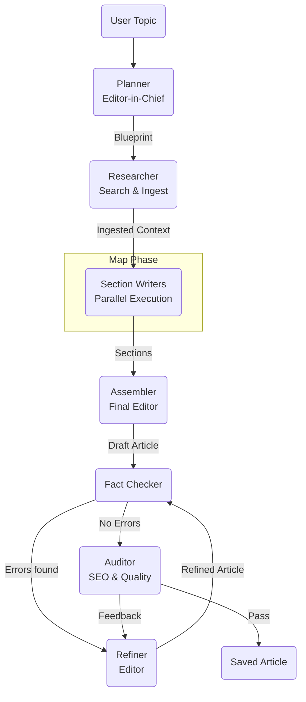

# GEMINI Map-Reduce Architecture Walkthrough

We have successfully implemented the "Editor-in-Chief" Hierarchical Map-Reduce architecture for ANCA. This new workflow allows for generating comprehensive, long-form articles by breaking the process down into specialized roles.

## Architecture Overview

The system uses `LangGraph` to orchestrate a team of agents:



## Agents

1.  **Planner (`agents/planner.py`)**:

    - **Role**: Editor-in-Chief.
    - **Task**: Takes the topic and generates a structured `Blueprint` containing 5-7 sections, each with a heading, description, word count, and search queries.
    - **Output**: `Blueprint` object.

2.  **Researcher (`agents/researcher.py`)**:

    - **Role**: Research Assistant.
    - **Task**: Iterates through all search queries in the blueprint. Uses DuckDuckGo to find URLs, scrapes them (max 8 sources total), and populates the `RAGTool` (ChromaDB).
    - **Output**: Populated Vector DB.

3.  **Writer (`agents/writer.py`)**:

    - **Role**: Section Specialist.
    - **Task**: Runs in parallel for each section. Retrieves specific context from the RAG tool for its assigned section and writes the content.
    - **Output**: A formatted Markdown section.

4.  **Assembler (`agents/assembler.py`)**:

    - **Role**: Final Editor.
    - **Task**: Stitches all sections together, adds an introduction and conclusion, and saves the final file.

5.  **Fact Checker (`agents/fact_checker.py`)**:

    - **Role**: Truth Verifier.
    - **Task**: Checks for hallucinations, incorrect dates, and impossible stats.
    - **Output**: Pass/Fail + Error Report.

6.  **Auditor (`agents/auditor.py`)**:

    - **Role**: SEO & Quality Control.
    - **Task**: Critiques the drafted article. If it fails SEO/Quality checks, sends feedback to the Refiner.
    - **Output**: Pass/Fail + Feedback.

7.  **Refiner (`agents/refiner.py`)**:
    - **Role**: Fixer.
    - **Task**: Rewrites the article based on Auditor feedback. Overwrites the file with the improved version.
    - **Output**: New Draft.

## Key Features

- **Map-Reduce Pattern**: Allows for unlimited article length scaling. Writers work in parallel (conceptually) and independent of each other's context window limits until assembly.
- **Multi-Provider Support**: Switch between AI providers easily.
  - **Gemini**: `gemini-2.0-flash-lite` (Default) with Rate Limiting (5 RPM).
  - **Groq**: `llama-3.3-70b-versatile` (Fast, high quality).
  - **Ollama**: `qwen2.5:7b-instruct` (Local, privacy-focused, zero cost).
- **Rate Limiting**: Built-in `TokenBucket` rate limiter to prevent 429 errors on free tiers.

- **Fact Check Workflow**: Ensures factual integrity before auditing.
- **SEO Audit Loop**: Automated "Reflection" step. The `Auditor` critiques the content, and the `Refiner` fixes it. Loops up to 3 times to ensure quality.

## Usage

Run the workflow using `uv run python run_graph.py` with the desired arguments:

### 1. Default (Gemini 2.0 Flash Lite)

```bash
uv run python run_graph.py --topic "Future of AI Agents"
```

### 2. Run with Ollama (Local)

```bash
uv run python run_graph.py --topic "Benefits of Cold Brew Coffee" --provider ollama --model qwen2.5:7b-instruct
```

### 3. Run with Groq

```bash
uv run python run_graph.py --topic "Advanced Python Patterns" --provider groq --model llama-3.3-70b-versatile
```

### 4. Automated Topic Discovery (New)

**Scout Mode (Global Trends):**
Finds a rising trend globally and halts (to show you what it found).

```bash
uv run python run_graph.py --discover --only-discovery
```

**Niche Mode (Targeted):**
Finds a trend within a specific niche.

```bash
uv run python run_graph.py --niche "Small Business AI" --only-discovery
```

**Full Auto Run:**
Remove `--only-discovery` to find a topic AND write the full article immediately.

```bash
uv run python run_graph.py --discover --provider gemini
```

## Project Structure

- `run_graph.py`: Main entry point and graph definition.
- `app/state.py`: Shared state schema (`ArticleState`).
- `agents/`: Agent implementations (`planner`, `researcher`, `writer`, `assembler`).
- `app/core/llm_wrappers.py`: `get_llm` factory and rate-limited wrappers.
- `app/core/rate_limiter.py`: Token bucket implementation.
